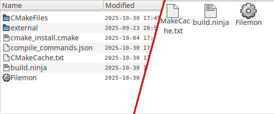

## FLEET
**FLEET** is a *fleet* of extra additions for the FLTK library.

It's designed to build on the capabilities of FLTK to add new, universal and useful widgets.

#### Disclaimer
This is pre-Alpha software. It has a few bugs and many things are not yet implemented. Breaking changes are guaranteed in future. Documentation is provided for most widgets, and is available at https://cyprinuscarpio.github.io/fleet/doc/html/index.html. 

#### New widgets:
- `Fle_Flat_Button`  
A button with hot tracking, that draws a frame only when the user is interating with it.
- `Fle_Dock_Host`  
A complex group that allows the program user to change it's appearance by moving/detaching/attaching various groups at different places.
- `Fle_Dock_Group`  
A container for any FLTK widget that allows it to be attached/detached to a `Fle_Dock_Host`. There are vertical and horizontal dock groups.
- `Fle_Listview`  
A traditional list view widget supporting 4 display modes by default: icons, small icons, list, details. Populated by `Fle_Listview_Item` or it's subclasses.

#### Docking in-depth
FLEET brings the widget docking ability known from other toolkits to FLTK. At the core of this design is the `Fle_Dock_Host`, which governs the positioning, scale and behaviour of the attached groups, and contains the **work widget** in the middle. The dock host can allow attaching of groups in 4 **directions**: top, right, bottom, left. The directions are divided into **lines** of dock groups. A dock group has a few key properties:
- Size: the width of the group in the case of horizontal groups, and height in the case of vertical groups.
- Min Size: the dock host is designed so as not to allow scaling a group below this size.
- Preferred Size: when the user changes the size of a group by moving/attaching it, it becomes the preferred size for the group. The dock host will not scale it above this size unless it's required to fill empty space in a line.
- Breadth: the height of the group in the case of horizontal groups, and the width in the case of vertical groups.
- Min Breadth: the dock host is designed so as not to allow scaling a group below this breadth.
- Detachability: a detachable group may be detached from the dock host and live in it's own window that can be moved around.
- Flexibility: a flexible group allows the user to change it's breadth.


All groups in a single line must be either flexible or not, therefore a line in itself can be called flexible or not.

There are several ways for the user to change those properties:
- Scaling between groups: the user can drag the border between two groups to move them.
- Scaling between lines: the user can drag the border between two lines. This will change the breadth of all the groups in both affected lines. However, this cannot change the total breadth of a direction. Flexible lines are not affected by this.
- Scaling the work widget: the user can drag the border of the work widget. This allows for the total breadth of a direction to change. For this to be allowed, at least one of the lines on the choosen direction must be flexible.

If a group is detachable, it may be detached by the user and floated in a non-modal window. When the user is moving the detached group, a timer is set. Once it elapses, a check is made to determine if and where the detached group should be attached. If the group is non-detachable, then if re-attaching it normally fails, the group is repositioned inside the host automatically, making it impossible to permanently detach it, only move it around.

Currently, the docking implementation is incompatible with with the server side decorations of the KWin Wayland compositor. To circumvent this problem, the application can use client side decorations drawn by libdecor bundled with FLTK, or draw it's own.

#### Listview


The listview has 4 display modes: icons, small icons, list and details. More can be added in a subclass. The items can be sorted in ascending/descending order or be left unsorted. Items can be added, inserted at a specified position and removed. The listview produces several callbacks that cover most use cases, such as item selected/deselected/reselected, item added/removed, DND event begin and end.

#### Accordion


A simple container widget that is useful for containing lots of widgets in a small area. The widgets are contained in individual, vertically positioned groups that can be opened or closed. Resizing the groups is made possible with dragging on their borders.

#### Code style
The preferred style for FLEET development is Allman style indentation, snake_case and no `auto` keyword.

#### Usage
FLEET is meant to be used as a statically linked submodule in your project. To include it in your compilation, simply use the `add_subdirectory` function in your CMakeLists.txt, and link against `Fleet`, like so:
```
add_subdirectory(fleet)
...
target_link_libraries(FleetUsingProject PRIVATE fltk Fleet)
```

The only dependency is FLTK 1.4 or above.
